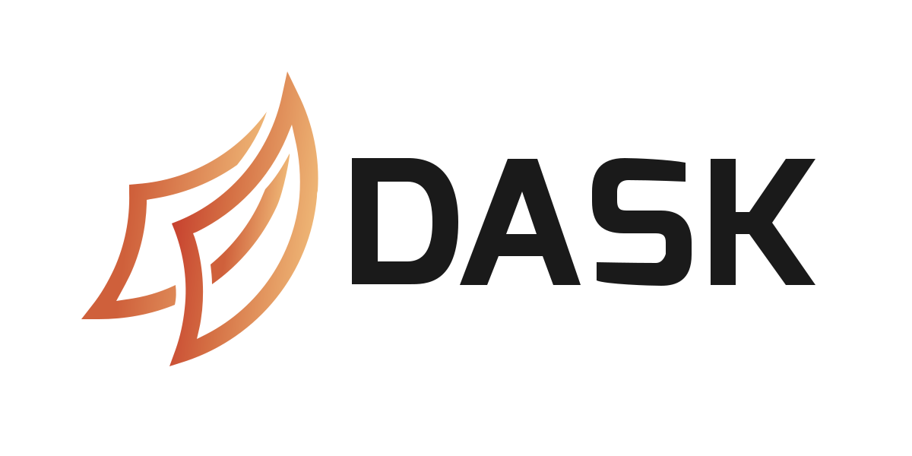
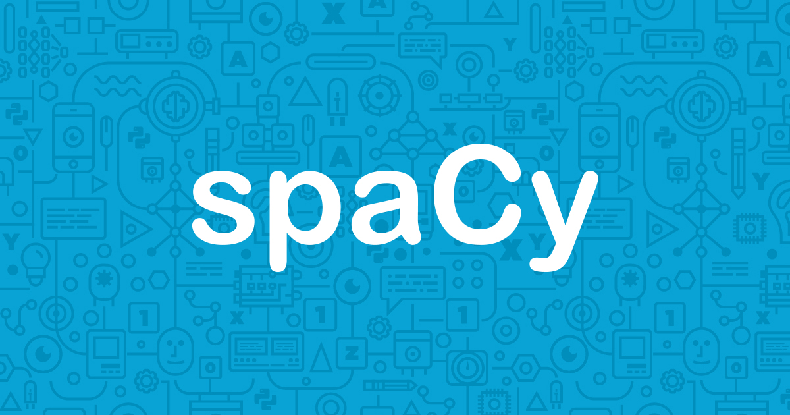
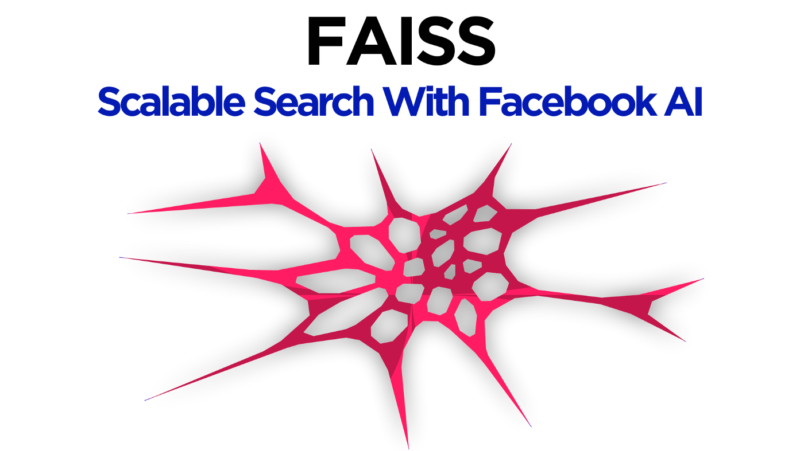
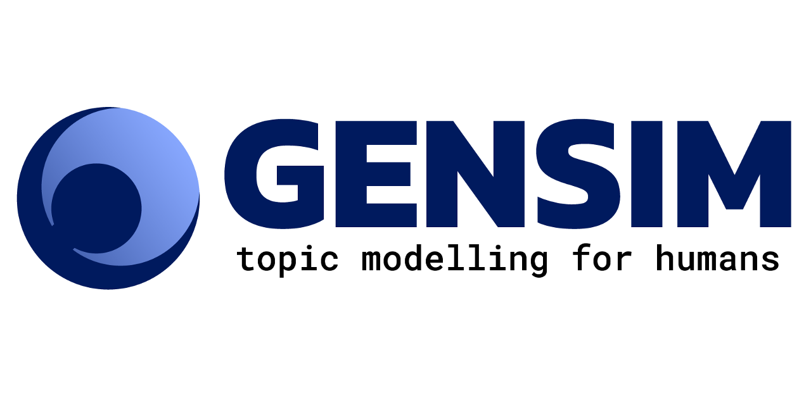

# Information_Retrieval_System_BERT
A Query-Document pair ranking system using GloVe embeddings and RankCosine.

### Semantic search
Have you ever wondered how you can create state-of-the-art unsupervised text embeddings and use them in downstream tasks like information retrieval?

In the last 5 years, Natural Language Processing (NLP) has leaped forward with the introduction of the new text embedding architectures, which brought large improvements to NLP applications. One of such application is semantic matching and search. Semantic search applies user intent, context, and conceptual meanings to match a user query to the corresponding content. It uses vector search and machine learning to return results that aim to match a user’s query, even when there are no word matches.
These components work together to retrieve and rank results based on meaningand proximity to a user-defined query.

In this project, I will illustrate how to build a semantic search engine using state-of-the-art vector space models. In implementing this workflow, we will build a system for accessing and retrieving the most appropriate information from text based on a particular query given by the user, with the help of context-based indexing.

### Motivation
Whether you want to sift through millions of social media posts, extract information from reports of medical trials and academic research, or simply retrieve relevant texts from thousands of documents, reports, and notes generated by an organization as a part of its daily operation, you would need an information retrieval system with the capability to match a query and its search intent to the relevant documents

The traditional approach for information retrieval, such as `BM25`, relies on word frequencies within indexed documents and on key terms within the query to estimate the relevance of said documents to the query. This approach has two key limitations that affect its accuracy. Documents that do not contain the keywords but include terms that are semantically similar to those keywords may be missed. For a pool of documents containing different languages, and especially languages with different scripts and alphabets, the keyword approach would fail. Hence the need for better architectures or structures.

### Requirements (Libraries & Packages)

  
.png)  
 

